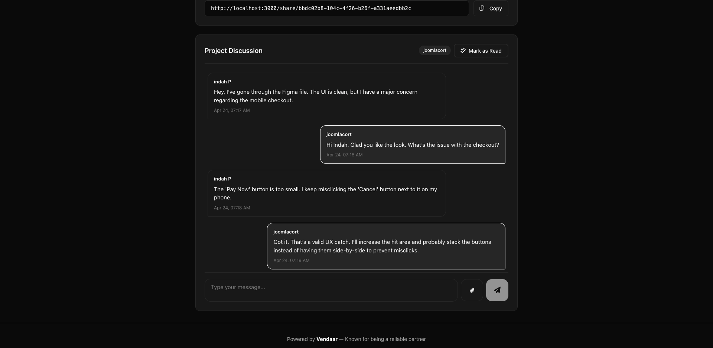
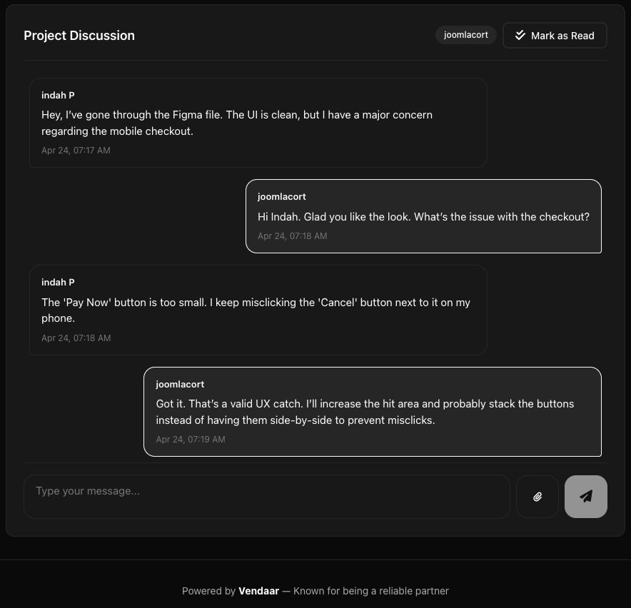
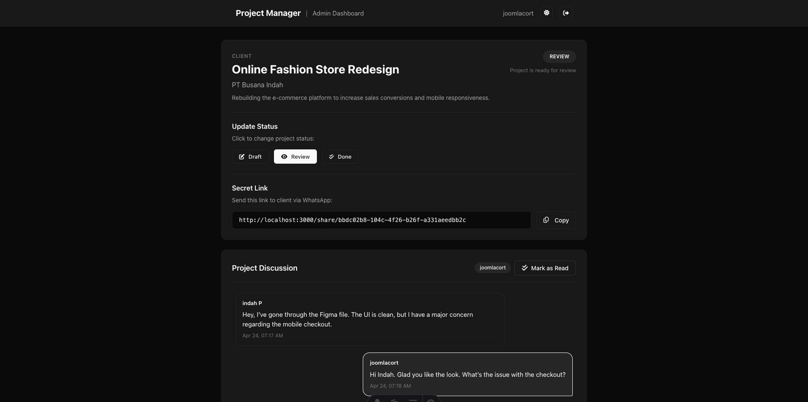
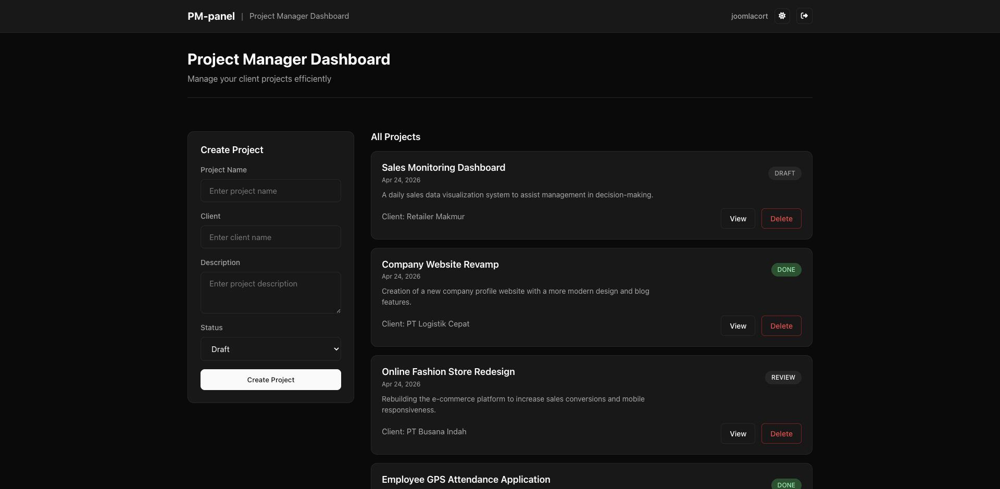
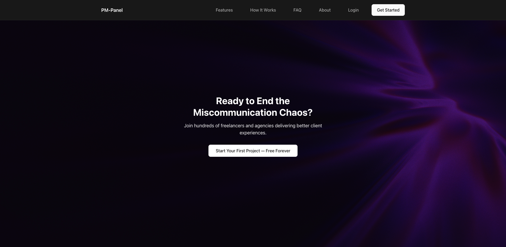

# PM-Panel: Project Management SaaS Platform

> **AI-Assisted Development Portfolio** | Demonstrating Technical Leadership & Collaborative Problem-Solving

---

## Executive Summary

PM-Panel adalah **Project Management SaaS Platform** yang dibangun dengan pendekatan **AI-Human Collaboration**. Platform ini menunjukkan kemampuan saya dalam:

- **Mengarahkan AI (Cascade)** untuk development kompleks
- **Architecting multi-tenant database systems**
- **Problem-solving & debugging**
- **Full-stack development** (Astro + Vue + Cloudflare + Turso)

**Status**: Production-Ready MVP | **Tech Stack**: Modern Edge-Native Architecture

---

## Project Goals & Achievement

### Original Vision

> "Buatkan saya project management tool untuk freelancer yang bisa handle multiple client dengan isolated data per project."

### What We Built

SaaS platform dengan arsitektur **"Master + Multi-Tenant Database"** yang memungkinkan:

- [X] Single dashboard untuk manage multiple projects
- [X] **Isolated database per project** (data terpisah, aman)
- [X] Client portal dengan shareable link
- [X] Real-time chat/notes per project
- [X] File upload & attachment support

---

## Technical Architecture

### High-Level Architecture Diagram

```
┌─────────────────────────────────────────────────────────┐
│                    USER INTERFACE                        │
│         ┌──────────┐        ┌──────────┐               │
│         │  Admin   │        │  Client  │               │
│         │ Dashboard│        │  Portal  │               │
│         └────┬─────┘        └────┬─────┘               │
└──────────────┼───────────────────┼──────────────────────┘
               │                   │
               ▼                   ▼
┌─────────────────────────────────────────────────────────┐
│              ASTRO + VUE 3 (SSR/SSG)                     │
│              Cloudflare Workers Runtime                  │
└─────────────────────────┬───────────────────────────────┘
                          │
               ┌──────────┴──────────┐
               │                     │
               ▼                     ▼
   ┌──────────────────┐   ┌────────────────────┐
   │   MASTER DB      │   │  TENANT DB(s)      │
   │   (Turso)        │   │  (Auto-Provisioned)│
   │                  │   │                    │
   │ • Users          │   │ • Notes            │
   │ • Projects       │   │ • Chat History     │
   │ • ShareTokens    │   │ • per Project      │
   └──────────────────┘   └────────────────────┘
```

### Key Architectural Decisions

| Decision                   | Rationale                             |
| -------------------------- | ------------------------------------- |
| **Multi-Tenant DB**  | Data isolation & security per client  |
| **Edge-Native (CF)** | Low latency globally, auto-scaling    |
| **Turso (LibSQL)**   | SQLite-compatible, edge-distributed   |
| **Astro + Vue**      | SEO-friendly + interactive components |

---

## AI Collaboration Methodology

### How I Worked With Cascade (AI Assistant)

```
MY ROLE                          CASCADE'S ROLE
─────────                        ──────────────
• Define product vision          • Code implementation
• Technical architecture         • Debug & troubleshoot  
• Review & validate              • Documentation
• Decision making                • Pattern suggestions
• QA & testing                   • Optimization ideas
```

### Collaboration Workflow

1. **Vision → Requirements**

   ```
   Me: "Saya butuh sistem dimana tiap project punya database sendiri"
   Cascade: "Multi-tenant architecture dengan Turso Platform API?"
   Me: "Yes, dan harus auto-provision saat project dibuat"
   ```
2. **Problem-Solving Session**

   ```
   Problem: "Delete project tidak menghapus tenant DB"
   Cascade: "Kita perlu extract DB name dari URL..."
   [Debug bersama, fix regex pattern]
   Result: Working tenant cleanup [OK]
   ```
3. **Code Review & Iteration**

   - Saya review setiap perubahan

- Kasih feedback: "Jangan pakai hardcoded value"
  - Cascade update dengan environment variables

### What This Demonstrates

| Skill                          | Evidence                                                |
| ------------------------------ | ------------------------------------------------------- |
| **Technical Leadership** | Mengarahkan AI untuk implementasi complex architecture  |
| **System Design**        | Desain multi-tenant database dari scratch               |
| **Problem-Solving**      | Debug & fix tenant DB provisioning, URL extraction      |
| **Code Review**          | Review, feedback, iterasi dengan AI                     |
| **Full-Stack Dev**       | Frontend (Vue) + Backend (Astro API) + Database (Turso) |

---

## Key Features Implemented

### 1. Multi-Tenant Database System

**Complexity**: 5/5

Setiap project auto-provision database sendiri di Turso:

```typescript
// Simplified flow:
Create Project → Provision Turso DB → Init Schema → Save Credentials
     ↓                ↓                    ↓            ↓
  Master DB    tenant-{slug}-{ts}    notes table    project record
```

**Problem Solved**:

- X Awalnya: Semua project share 1 database → data bercampur
- ✓ Sekarang: Tiap project punya DB terpisah → data isolated & aman

### 2. Client Portal with Shareable Links

**Complexity**: 4/5

- Generate unique share token per project
- Client access tanpa login (via `/share/{token}`)
- Client bisa kirim notes/chat
- Real-time updates

### 3. Real-Time Chat System

**Complexity**: 4/5

- Vue 3 reactive components
- File upload dengan preview
- Attachment support (images & files)
- Lightbox untuk image preview

### 4. Theme System (Dark/Light)

**Complexity**: 3/5

```css
:root { /* Light mode */ }
[data-theme="dark"] { /* Dark mode */ }
```

- CSS variables untuk semua colors
- Persist preference di localStorage
- Toggle component

---

## Screenshot Gallery

### Dashboard Admin


*Dashboard utama dengan project list, form create project, dan real-time chat*

### Client Portal


*Client portal dengan project info, status, dan discussion thread*

### Project Detail & Chat


*Real-time chat dengan file attachment dan image lightbox*

### Multi-Tenant Architecture Proof


*Bukti tiap project punya database terpisah di Turso dashboard*

### Landing Page


*Professional landing page dengan feature showcase*

---

## Tech Stack Deep Dive

### Frontend

| Technology              | Purpose                                |
| ----------------------- | -------------------------------------- |
| **Astro**         | SSR/SSG framework, optimal performance |
| **Vue 3**         | Interactive components (chat, forms)   |
| **CSS Variables** | Theme system (dark/light mode)         |
| **Font Awesome**  | Icons                                  |

### Backend & Database

| Technology                   | Purpose                             |
| ---------------------------- | ----------------------------------- |
| **Cloudflare Workers** | Edge functions, auto-scaling        |
| **Turso (LibSQL)**     | SQLite-compatible, edge-distributed |
| **Drizzle ORM**        | Type-safe database queries          |
| **Turso Platform API** | Programmatic DB provisioning        |

### DevOps & Tools

| Technology                         | Purpose                 |
| ---------------------------------- | ----------------------- |
| **Bun**                      | Fast JavaScript runtime |
| **TypeScript**               | Type safety             |
| **Astro Cloudflare Adapter** | Deployment target       |

---

## Complex Problems Solved

### Problem 1: Auto-Provisioning Tenant Database

**Challenge**: Saat create project, harus otomatis buat database di Turso dan init schema.

**Solution Flow**:

```
1. POST /api/projects
2. Generate unique slug: "my-project-moc9rsqq"
3. Call Turso Platform API: POST /organizations/{org}/databases
   Body: { name: "tenant-my-project-moc9rsqq", location: "sin", group: "pm-panel-tenants" }
4. Create auth token untuk DB baru
5. Init schema (create notes table)
6. Save dbUrl & dbToken ke project record
```

**My Role**:

- Define the flow
- Review error handling ("What if provisioning fails?")
- Validate environment variable setup
- Test dengan multiple projects

### Problem 2: Extracting DB Name from URL

**Challenge**: Saat delete project, perlu extract nama DB dari URL untuk delete di Turso.

**URL Format**: `libsql://tenant-{slug}-{timestamp}-{org}.{region}.turso.io`

**Initial Code (Bug)**:

```javascript
const dbName = hostname.split('-').slice(0, 3).join('-');
// X Returns: "tenant-port1" (kurang timestamp)
```

**Fixed Code**:

```javascript
const parts = hostname.split('-');
const timestampIndex = parts.findIndex(p => /\d/.test(p));
const dbName = parts.slice(0, timestampIndex + 1).join('-');
// ✓ Returns: "tenant-port1-moc9rsqq" (correct)
```

**My Role**:

- Identify bug dari logs
- Debug bersama Cascade
- Test fix dengan create → delete flow

### Problem 3: Data Isolation

**Challenge**: Pastikan data tiap project benar-benar terpisah.

**Initial Design (Wrong)**:

```typescript
// X Semua notes di 1 tabel dengan projectId
export const notes = sqliteTable('notes', {
  id: integer('id').primaryKey(),
  projectId: integer('project_id'), // Ini kurang aman
  content: text('content'),
});
```

**Final Design (Correct)**:

```typescript
// ✓ Tiap project punya DB sendiri, notes table tanpa projectId
// Master DB: projects table (id, name, slug, tursoDbUrl, tursoDbToken)
// Tenant DB: notes table (id, content, createdAt) - no projectId needed!
```

**My Role**:

- Question initial design: "Kalau semua di 1 DB, bisa di-query cross project"
- Research best practices untuk multi-tenant
- Decide: "Tiap project harus punya DB sendiri"
- Guide Cascade implementasi

---

## Performance & Scalability

### Why This Architecture Scales

| Aspect             | How It's Handled                                 |
| ------------------ | ------------------------------------------------ |
| **Database** | Turso = SQLite at edge, auto-replicate           |
| **Compute**  | Cloudflare Workers = serverless, pay-per-request |
| **Storage**  | File upload ke Cloudflare R2 (S3-compatible)     |
| **Sessions** | Cloudflare KV untuk session storage              |

### Cost Structure (Turso Free Tier)

- 500 databases (cukup untuk 500 projects!)
- 9GB total storage
- 1B row reads / 10M row writes

---

## What I Learned (As Lead Developer)

### Technical Skills Enhanced

1. **Multi-tenant Architecture** - Pattern untuk SaaS dengan data isolation
2. **Edge-Native Development** - CF Workers + Turso = low latency globally
3. **API Design** - RESTful endpoints dengan proper error handling
4. **Database Provisioning** - Programmatic DB creation & management

### Soft Skills Demonstrated

1. **AI Collaboration** - Efektif mengarahkan AI untuk development kompleks
2. **Decision Making** - Pilih arsitektur, evaluate trade-offs
3. **Quality Assurance** - Review code, test scenarios, edge cases
4. **Documentation** - Articulate technical decisions

---

## Future Roadmap

### Phase 2 Features (Planned)

- [ ] Email notifications untuk new messages
- [ ] WebSocket untuk real-time chat
- [ ] Project templates
- [ ] Analytics dashboard
- [ ] Team collaboration (multi-user per project)

### Phase 3 (Scale)

- [ ] Custom domain per client portal
- [ ] White-labeling options
- [ ] API untuk integrations (Slack, Discord)
- [ ] Mobile app (React Native / Capacitor)

---

## AI Collaboration Credits

**AI Assistant**: Cascade (by Windsurf)
**Human Lead**: [Your Name]

### Collaboration Stats

- **Total Sessions**: ~15 coding sessions
- **Lines of Code**: ~3000+ (TypeScript/Vue/Astro)
- **Files Created/Modified**: 40+ files
- **Problems Solved**: 20+ technical challenges
- **Debug Iterations**: 50+ fix-test cycles

---

## Appendix: Project Structure

```
PM-Panel/
├── src/
│   ├── components/vue/     # Vue 3 interactive components
│   ├── db/               # Database schema (Drizzle)
│   ├── layouts/          # Astro layouts
│   ├── lib/              # Utilities (Turso, Query, etc)
│   ├── pages/            # Astro pages + API routes
│   └── pages/api/        # REST API endpoints
├── public/
│   ├── screenshot/       # Project screenshots
│   └── uploads/          # File uploads
├── global-styling.css    # Consolidated CSS
└── DOKUMENTASI.md        # This file
```

---

> *"The best developers don't just write code—they architect solutions, solve problems, and know how to leverage tools (including AI) effectively. This project demonstrates all three."*

**© 2025 PM-Panel | Built as AI Native Engineer**
